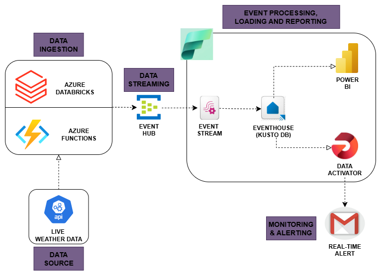

# 🌦️ Real-Time Weather Monitoring System Using Azure

## 📌 Introduction

This project is an end-to-end **real-time streaming weather monitoring system** built using various Azure services. It fetches live weather data, processes it, streams it using **Azure Event Hub**, loads it into **Microsoft Fabric (Kusto DB)**, visualizes it with **Power BI**, and sends **real-time alerts via email** using **Data Activator**.

> 🔔 **Objective:**  
> Build a fully automated system that continuously updates weather data for a preferred location and sends real-time alerts during extreme weather conditions (e.g., storms, heatwaves).

---

## 🧱 Architecture Overview

<!-- Replace 'path/to/your_architecture_diagram.png' with the actual image path or GitHub URL -->

**Architecture Flow:**

- Weather data is fetched using a public API.
- Data ingested via **Azure Databricks** or **Azure Functions**.
- Streamed to **Azure Event Hub**.
- **Microsoft Fabric's Event Stream** pulls data from Event Hub.
- Data is stored in **Kusto DB** (KQL Database) using Eventhouse.
- Real-time dashboard created with **Power BI** (auto-refresh enabled).
- **Data Activator** triggers real-time alerts (via email) on extreme conditions.

---

## ⚙️ Technologies Used

| Service              | Purpose                                                |
|----------------------|--------------------------------------------------------|
| **Azure Databricks** | Data ingestion & weather API processing                |
| **Azure Function**   | Alternate ingestion (more cost-effective)              |
| **Azure Event Hub**  | Streaming real-time data                               |
| **Microsoft Fabric** | Event Stream + Eventhouse (KQL DB) + Data Activator    |
| **Power BI**         | Real-time dashboards and reporting                     |
| **Azure Key Vault**  | Secure storage of API keys and Event Hub credentials   |

---

## 🔐 Secure API Access with Azure Key Vault

To keep API keys and Event Hub credentials secure:
- Secrets (like API keys and Event Hub keys) are stored in **Azure Key Vault**.
- **Azure Databricks** and **Azure Functions** access them securely using environment variables or linked service authentication.
- This approach protects sensitive data and supports best practices for enterprise-grade security.

---

## 💰 Cost Comparison & Architecture Decision

| Component          | Performance        | Cost Efficiency     |
|--------------------|--------------------|---------------------|
| **Azure Databricks** | High (suitable for larger loads) | Moderate/High cost |
| **Azure Functions**  | Ideal for smaller tasks | Low cost  |

> **Conclusion:**  
> Since this project involves small-scale ingestion (weather data), **Azure Functions** is more cost-effective. However, Databricks is also implemented for comparison and scalability testing.

---

## 🔗 API Reference

- **Weather API**: [Open-Weather API](https://www.weatherapi.com/)
  - Free to use under trial – up to **1 million API calls per month**.
  - Provides **temperature**, **air quality**, **forecast**, and other key weather metrics.

---

## 🚀 How to Build This Project

### Step-by-Step Guide

#### 🔧 1. Set Up Azure Resources

- Create a Resource Group.
- Create and configure:
  - **Azure Databricks**
  - **Azure Function App**
  - **Azure Event Hub**
  - **Azure Key Vault** (store API keys)
  - **Microsoft Fabric** (and connect Power BI with Fabric Capacity)

---

#### ⚙️ 2. Ingestion Option 1: Azure Databricks

- Create **Event Hub** and **Shared Access Policy**.
- Store access keys in **Key Vault**.
- Set up **Databricks cluster** and install **Event Hub library**.
- Configure secrets in Databricks from Key Vault.
- Test the **Weather API** in Databricks.
- Build ingestion pipeline to **stream data to Event Hub**. [Code](./DATA%20INGESTION_CODES/DATABRICKS_NOTEBOOKS/complete_code_for_getting_the_weather_data.py)

---

#### ⚙️ 3. Ingestion Option 2: Azure Functions

- Create a Function to call the Weather API and send data to Event Hub. [Code](./DATA%20INGESTION_CODES/AZURE_FUNCTION/function_app.py)
- Secure credentials via **Key Vault**.
- Use this option for **lower cost** and **efficient performance**.

---

#### 🔄 4. Event Processing and Loading into KQL DB

- In Power BI (Fabric), create an **Eventhouse** (auto-creates a KQL DB).
- Use **Event Stream** to connect Event Hub to Eventhouse.
- Data is continuously streamed and stored for querying.

---

#### 📊 5. Power BI Dashboard [Power BI Dashboard link](222852_Weatherreport.pbix)

- Create a Power BI report linked to the KQL DB.
- Turn on **Automatic Page Refresh** for live updates.
- Customize visuals to show temp, air quality, alerts, etc.

---

#### 📣 6. Real-Time Alerts

- Create a query to filter alerts
- Set up Data Activator to send email notifications for these alerts.

